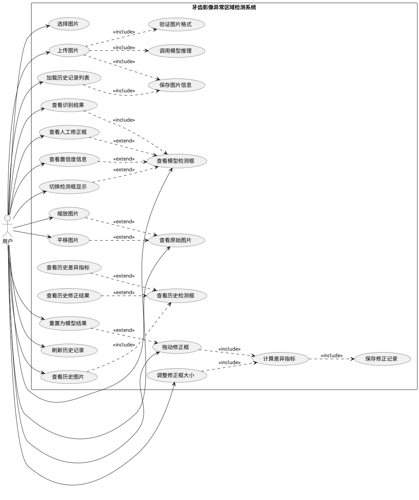
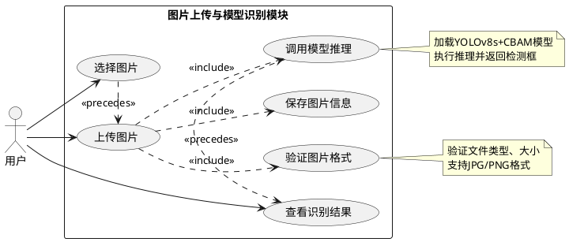
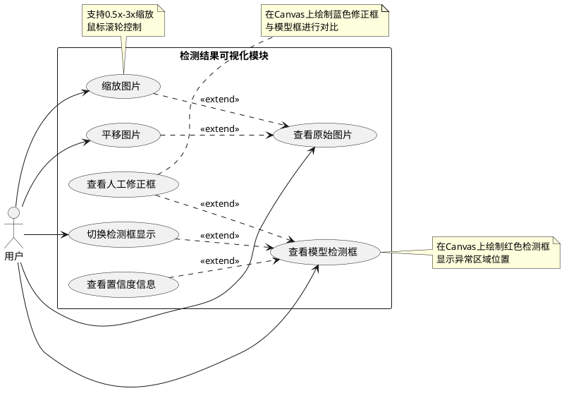
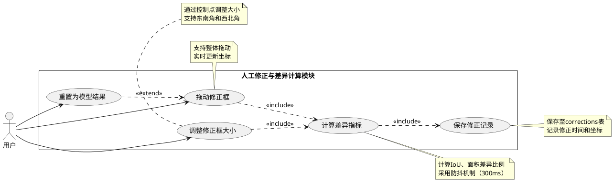
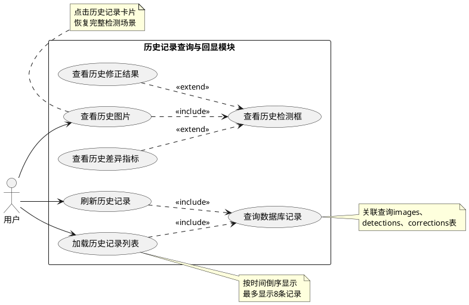

# 牙齿影像异常区域检测系统 - 用例图设计

## 1. 系统总用例图



---

## 2. 模块1：图片上传与模型识别功能用例图



---

## 3. 模块2：检测结果可视化功能用例图



---

## 4. 模块3：人工修正与差异计算功能用例图



---

## 5. 模块4：历史记录查询与回显功能用例图



---

## 6. 用例关系说明

### Include关系（包含关系）
表示基础用例**必须**调用被包含的用例，是强制性的依赖关系。

| 基础用例 | 包含用例 | 说明 |
|---------|---------|------|
| 上传图片 | 验证图片格式 | 上传时必须验证格式 |
| 上传图片 | 保存图片信息 | 上传后必须保存到数据库 |
| 上传图片 | 调用模型推理 | 上传后必须执行检测 |
| 查看识别结果 | 查看模型检测框 | 查看结果必然包含检测框 |
| 拖动修正框 | 计算差异指标 | 修正后必须计算差异 |
| 调整修正框大小 | 计算差异指标 | 调整后必须计算差异 |
| 计算差异指标 | 保存修正记录 | 计算后必须保存记录 |
| 加载历史记录列表 | 查询数据库记录 | 加载必须查询数据库 |
| 查看历史图片 | 查看历史检测框 | 查看历史必然包含检测框 |

### Extend关系（扩展关系）
表示在特定条件下，基础用例**可以**被扩展用例增强，是可选的功能。

| 基础用例 | 扩展用例 | 条件 |
|---------|---------|------|
| 查看模型检测框 | 查看人工修正框 | 用户已进行修正 |
| 查看模型检测框 | 查看置信度信息 | 用户需要查看置信度 |
| 查看模型检测框 | 切换检测框显示 | 用户需要隐藏/显示框 |
| 查看原始图片 | 缩放图片 | 用户需要放大查看细节 |
| 查看原始图片 | 平移图片 | 用户需要移动视图 |
| 拖动修正框 | 重置为模型结果 | 用户需要撤销修正 |
| 查看历史检测框 | 查看历史修正结果 | 历史记录包含修正 |
| 查看历史检测框 | 查看历史差异指标 | 历史记录包含差异数据 |

---

## 7. 使用说明

### 生成UML图的方法

1. **在线工具**：
   - 访问 http://www.plantuml.com/plantuml/uml/
   - 复制上述PlantUML代码
   - 自动生成PNG/SVG图片

2. **VS Code插件**：
   - 安装"PlantUML"插件
   - 创建.puml文件，粘贴代码
   - 按Alt+D预览

3. **命令行工具**：
   ```bash
   java -jar plantuml.jar usecase.puml
   ```

### 图表特点

✅ **总用例图**：包含所有24个用例，展示完整系统功能  
✅ **模块用例图**：按4个功能模块分组，便于理解  
✅ **Include关系**：用虚线箭头+<<include>>标注强制依赖  
✅ **Extend关系**：用虚线箭头+<<extend>>标注可选扩展  
✅ **注释说明**：关键用例添加note说明实现细节  
✅ **符合规范**：遵循UML 2.5标准用例图规范

---

## 8. 论文中的使用建议

### 图3-2 系统总用例图
放在第3章"系统分析"的3.3节，展示系统整体功能结构。

### 图4-3至图4-6 模块用例图
分别放在第4章"系统设计"的4.2.1至4.2.4节，对应各功能模块。

### 文字说明模板
```
如图X-X所示，[模块名称]包含X个主要用例。其中，[用例A]通过include关系
强制调用[用例B]，确保[功能描述]；[用例C]通过extend关系可选地扩展[用例D]，
在[条件]时提供[增强功能]。该设计体现了系统的[设计理念]。
```

